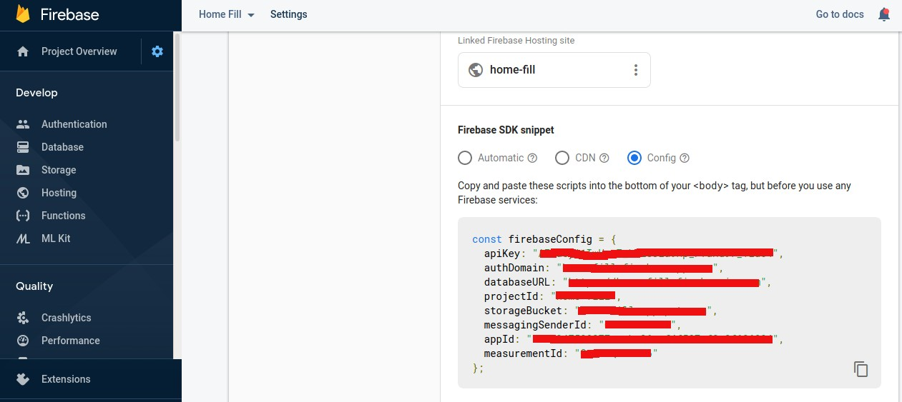
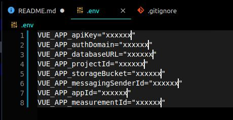
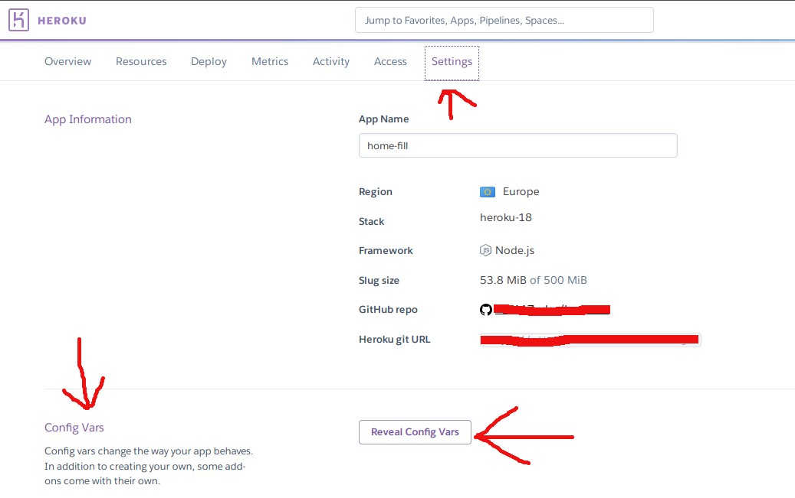
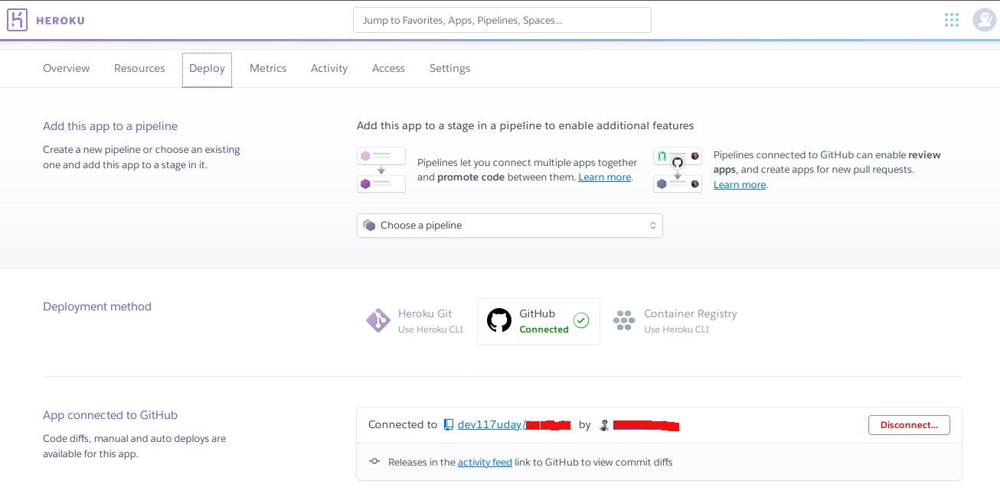
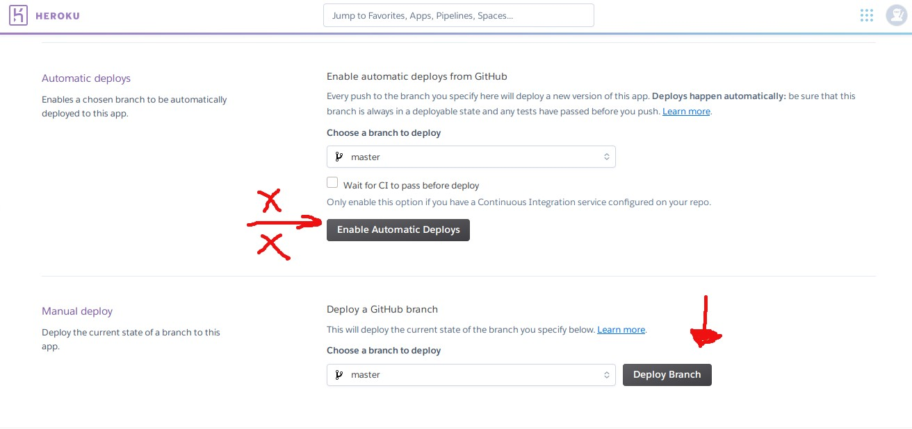

# boiler-plate-vue-firebaseAuth-heroku-deploy in Js

### Install @vue/cli 3

```bash
npm install -g @vue/cli
```

You can check you have the right version with this command:

```bash
vue --version
```

## Project Setup

First clone this repo, go inside the project folder to install dependencies :

```js
npm install
```

## Compiles and hot-reloads for development

```js
npm run serve
```

### Compiles and minifies for production

```js
npm run build
```

### Lints and fixes files

```js
npm run lint
```


#### Add your details in package.json


## Adding Firebase Config



1. There is a file in project folder called **.env**, create a new firebase project, initialise web project and paste the config keys from project settings :

Example

   1. ```bash
      VUE_APP_api=""
      ```

   2. don't add spaces, keep everything inside strings

3. Then add .env to .gitignore file




## Deploying to Heroku

 1. run : 

     1. ```git
        git init && git add --all
        ```

     2. ```git
        git commit -m "commit message"
        ```

       3. Run :

          ```js
          npm run build
          ```

           1. you can check your code by opening **index.html** is **dist/**

           2. Or run : 

               1. ```bash
                node server.js
                  #or
                nodemon server.js
                  ```

     4. Push the code-base to your own git repo

     5. Open your Heroku account

     6. Create a new app

     7. In settings, add all the env variables that you configured in .env

     

     8.	In the deploy section, connect your account with GitHub.

     
     
     9.	Select the repo containing your this code-base
     
     10.	Change the settings as per your config (recommended : do not select automatic deploy if using free tier)
     
     
     
     11.	Click deploy master branch.


## Your app will deployed to link mentioned in build log

# Congrats


#### if you have anything to say,bugs, feature requests, or anything else , please a leave a msg in Issues section.
