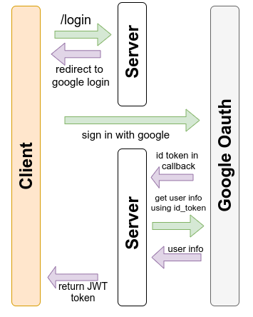

# Golang Auth with google

## Things todo (Project Level)
- [ x ] Create a error handling system
- [ x ] Use some sort of logging system
- [ x ] database repository pattern


## API Design

### Authentication
- Used Google OAuth and JWT to verify user and protect routes

**The project is only a backend server, hence i had to modify the oauth workflow to preform a callback (from google) to the server instead of client**



After getting the user info from Google, server executes an `query` to the db : 

- insert if the user exists 
- else do nothing in case of conflict (user_id is the primary key)

```sql
              Table "public.users"
 Column  | Type | Collation | Nullable | Default 
---------+------+-----------+----------+---------
 id      | text |           | not null | 
 name    | text |           | not null | 
 picture | text |           | not null | 
Indexes:
    "users_pkey" PRIMARY KEY, btree (id)
Referenced by:
    TABLE "items" CONSTRAINT "fk_users_item" FOREIGN KEY (user_id) REFERENCES users(id)

```

- After which, server generates a JWT token containing the following fields and returns it.
	- `id`
	- `expire_time` : 3 hours

---

**.env file**

```dotenv
GOOGLE_Client_ID=""
GOOGLE_Client_Secret=""
FRONTEND_URL="http://localhost:5000/"
BACKEND_URL="localhost:8080"
JWT_KEY=""
SQL_DB_USER=""
SQL_DB_PASS=""
SQL_DB_DB=""
SQL_DB_HOST=""
SQL_DB_PORT=""
State=""
```

**Database Setup**
```sh
sudo docker pull postgres:13.2-alpine
sudo docker run --name go_svelte -e POSTGRES_PASSWORD=password -d -p 5432:5432 postgres:13.2-alpine
sudo docker exec -it go_svelte bash
psql -U postgres

CREATE USER go_svelte WITH PASSWORD 'password';
ALTER ROLE go_svelte WITH CREATEDB;
CREATE DATABASE godb WITH OWNER go_svelte;
```
